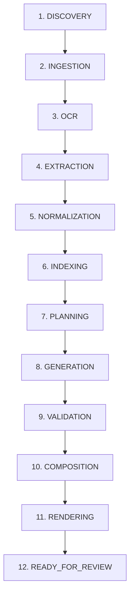

# Architecture Document 20: Controlled Agent Tool Sandbox & Unified 12-Stage Resumable Orchestration

## 1. Context & Executive Overview
In accordance with **Section 23 (Controlled Agent Tools)** and **Section 27 (Unified 12-Stage Report Job Orchestration)** of the *Master Implementation Plan*, this document formalizes:
1. The **Security Sandbox & Tool Dispatch Engine** restricting autonomous agent actions to predefined, verifiable functions with strict boundary enforcement, human authorization tokens for external/destructive actions, and cryptographic/tamper-evident audit trails.
2. The **Unified 12-Stage Resumable Pipeline Orchestrator** enabling persistent checkpointing in SQLite (`data/workspace/report_jobs.db`), transparent observability via desktop UI, and deterministic execution from file discovery through publication review.

---

## 2. Section 23: Controlled Agent Tools Architecture

### 2.1 Threat Model & Security Posture
The LLM agent in Coal India's air-gapped system operates under an adversarial/zero-trust assumption:
- **No Direct Shell or Filesystem Access**: The LLM agent cannot invoke arbitrary shell processes, open raw sockets, or write arbitrary files outside its managed sandboxes.
- **Path Traversal Shield**: Every path parameter provided to agent tools (`document_id`, `report_id`, `asset_id`) is strictly resolved against canonical workspace directories. Any attempt containing `..`, absolute paths escaping the root, or hidden dot-files triggers a `Sandbox Violation` and security audit alert.
- **Strict Read/Write Classification**:
  - `READ_ONLY`: Zero side-effects (e.g. `search_documents`, `get_source`, `get_page`, `get_table`, `get_spreadsheet_range`, `get_image`).
  - `MODIFICATION`: Changes local draft state inside the report workspace (e.g. `update_section`, `validate_section`, `render_preview`, `export_pdf`).
  - `HIGH_RISK_EXTERNAL`: Potential boundary crossing or data dispatch (e.g. `upload_report`). Requires a valid cryptographic human authorization token (`AUTH_CIL_DIRECTOR_APPROVED`).

### 2.2 Controlled Tool Registry & Signatures
The complete set of 11 controlled agent tools implemented in `core/reports/agent/tools.py`:

| Tool Name | Risk Level | Requires Human Approval | Description |
| :--- | :--- | :---: | :--- |
| `search_documents` | `READ_ONLY` | No | Full-text and vector BM25/hybrid search over normalized canonical document text elements. |
| `get_source` | `READ_ONLY` | No | Retrieves full document metadata, hash provenance, and page counts. |
| `get_page` | `READ_ONLY` | No | Retrieves canonical text lines, bounding boxes, and structure of a specific page. |
| `get_table` | `READ_ONLY` | No | Retrieves structured extracted table grid, header hierarchies, and numeric confidence. |
| `get_spreadsheet_range` | `READ_ONLY` | No | Extracts cell formulas, values, and tabular ranges from Excel/CSV workbooks. |
| `get_image` | `READ_ONLY` | No | Extracts and serves an indexed diagram or chart asset with metadata. |
| `update_section` | `MODIFICATION` | No | Modifies narrative block text or table data within a specified section. |
| `validate_section` | `MODIFICATION` | No | Validates numerical consistency, math formulas, and citation provenance. |
| `render_preview` | `MODIFICATION` | No | Generates an instantaneous HTML preview of draft sections using dual templates. |
| `export_pdf` | `MODIFICATION` | No | Compiles publication-ready PDF artifact via ReportLab with running headers/footers. |
| `upload_report` | `HIGH_RISK_EXTERNAL` | **Yes** | Transmits finalized report to external Ministry or CIL portal; requires token. |

### 2.3 Audit Logging & Provenance
Every invocation of an agent tool writes a structured record to `core/security/audit.py` with `AuditEventType.AGENT_ACTION`:
- Timestamp (UTC ISO-8601)
- Operator / Agent ID
- Tool name and arguments hash
- Execution status (`success`, `error`, `requires_approval`)
- Tamper-evident hash chain linking to previous audit record

---

## 3. Section 27: Unified 12-Stage Resumable Orchestration

### 3.1 The 12 Deterministic Lifecycle Stages
To ensure 100% predictability and auditability, both ingestion and full publication workflows are divided into 12 deterministic stages:

1. **DISCOVERY**: Scans specified source folder, counts files, records SHA-256 hashes, classifies MIME types.
2. **INGESTION**: Validates file integrity against corruption and isolates supported formats.
3. **OCR**: Detects scanned or image-only documents and processes through Docling / PaddleOCR / PyMuPDF fallback.
4. **EXTRACTION**: Parses text, structured tables, and figures into intermediate representations.
5. **NORMALIZATION**: Maps diverse subsidiary formats (BCCL, CCL, ECL, etc.) into canonical unified data structures.
6. **INDEXING**: Generates BM25 lexical indices and dense vector embeddings into local SQLite & vector storage.
7. **PLANNING**: Formulates subsidiary report outline, TOC, key KPI targets, and section assignments.
8. **GENERATION**: Drafting agent drafts narrative text with strict grounding and inline citation IDs.
9. **VALIDATION**: Runs deterministic numerical cross-checks, reconciliation engines, and citation verifiers.
10. **COMPOSITION**: Assembles sections, charts, tables, and executive summary into unified `Report` object.
11. **RENDERING**: Compiles dual HTML previews and publication-grade PDF via ReportLab.
12. **READY_FOR_REVIEW**: Emits final event notifying desktop UI operator that the report is locked and ready for sign-off.

### 3.2 Checkpointing & Resumability
- **SQLite Persistence**: Stored in `data/workspace/report_jobs.db` with WAL mode enabled.
- **State Serialization**: Checkpoints include completed stages, stage execution duration, current progress percentage, configuration parameters, and serialized intermediate artifact paths.
- **Interruption Recovery**: If the system shuts down or encounters an unexpected failure, the job manager preserves the last successful stage checkpoint. Resuming the job with `POST /api/v1/report-jobs/{job_id}/resume` continues immediately from the next uncompleted stage without reprocessing earlier stages.

---

## 4. API Endpoints Reference

### 4.1 Controlled Agent Tools (`/api/v1/agent/tools`)
- `GET /api/v1/agent/tools`: Lists all 11 registered tools, parameter schemas, risk levels, and human approval flags.
- `POST /api/v1/agent/tools/execute`: Dispatches an agent tool call within the security sandbox.

### 4.2 Report Job Pipeline (`/api/v1/report-jobs`)
- `POST /api/v1/report-jobs/start`: Initiates a new 12-stage publication workflow.
- `GET /api/v1/report-jobs`: Lists all report pipeline jobs with progress, current stage, and status.
- `GET /api/v1/report-jobs/{job_id}`: Retrieves detailed job state, configuration, and completed stages.
- `POST /api/v1/report-jobs/{job_id}/pause`: Pauses an active job safely at the next stage boundary.
- `POST /api/v1/report-jobs/{job_id}/resume`: Resumes a paused or interrupted job from its last checkpoint.
- `POST /api/v1/report-jobs/{job_id}/cancel`: Halts job execution and transitions state to `CANCELLED`.
