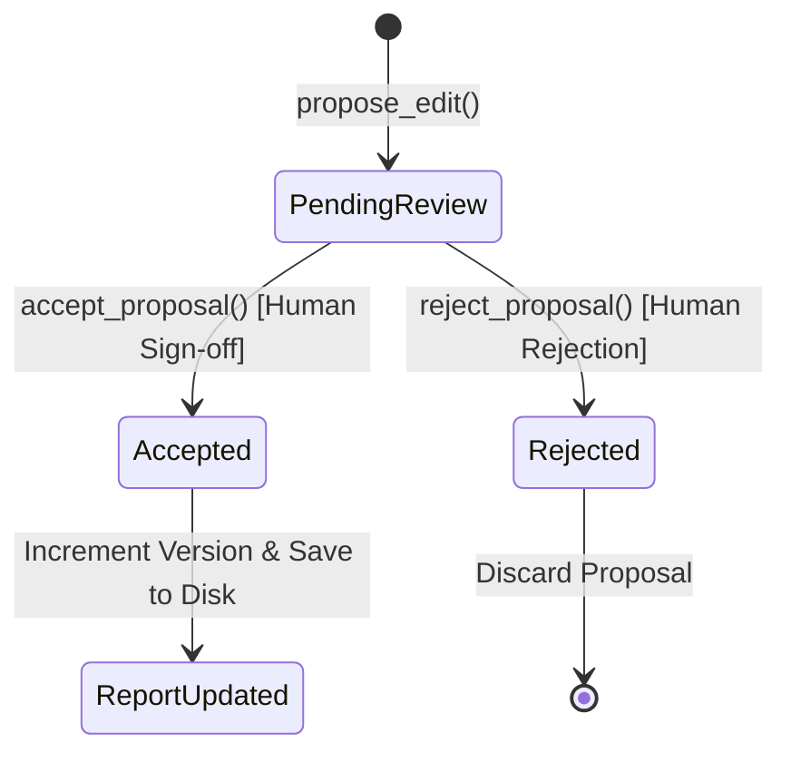

# Architecture Document 21: Image Intelligence, Human-in-the-Loop Review Diff, & Section Invalidation

## 1. Context & Architectural Overview
In strict compliance with **Section 18 (Image Intelligence System)**, **Section 22 (Human + Agent Review System)**, **Section 28 (Incremental Report Generation)**, and **Section 32 (Report Quality Metrics)** of the *Master Implementation Plan*, this document specifies:
1. **The Image Intelligence & Deterministic Layout Engine**: A structured asset pipeline transforming raw photographs, diagrams, and mine schematics into cataloged, deduplicated, and professionally styled visual presentations without allowing the LLM to guess raw coordinate values.
2. **The Human-in-the-Loop Agent Review System**: An interactive correction and review workflow that strictly forbids blind string find/replace, enforcing evidence re-grounding, mathematical validation, and human sign-off via a visual side-by-side diff.
3. **Section Dependency & Selective Invalidation**: Granular tracking of source dependencies preventing costly re-generation of complete corporate publications when isolated metrics or sources change.
4. **Report Quality Metrics Engine**: Measurable, audit-ready scorecard assessing provenance coverage, unsupported claims, and numerical precision.

---

## 2. Section 18: Image Intelligence Architecture

### 2.1 The Visual Asset Pipeline
The system enforces a strict separation of concerns:
```
Raw Images / Source PDFs
          |
          v
ImageAssetAnalyzer (Technical metrics, dHash, Quality Score, Semantic Topic Tags)
          |
          v
ImageAssetCatalog (SQLite database in data/workspace/assets.db)
          |
          v
Report Planner (AI recommends semantic image tags & relevant topics)
          |
          v
Deterministic Layout Engine (Resolves exact CSS / ReportLab geometries)
```

### 2.2 Perceptual Hashing (dHash) & Deduplication
To prevent duplicate figures across multiple drafts:
- **dHash Algorithm**: Resizes image to $9 \times 8$ grayscale matrix using Lanczos interpolation. Computes row-wise horizontal gradient comparisons yielding a 64-bit fingerprint represented as a 16-character hexadecimal string.
- **Hamming Distance Gate**: When comparing asset hashes, $\text{distance} \le 4$ bits triggers automatic near-duplicate classification (`is_duplicate = True`, `duplicate_of = original_asset_id`), protecting publication layout from visual redundancies.

### 2.3 Quality Grading & Topic Classification
Images are evaluated against four empirical quality grades:
- `EXCELLENT`: Width $\ge 1400$px and Height $\ge 800$px, suitable for full-width hero banners.
- `ACCEPTABLE`: Suitable for standard two-column inline layouts ($\ge 600$px).
- `LOW_RES`: Constrained to thumbnail or side-column placement ($< 450$px).
- `UNSUITABLE`: Rejected from publication ($< 150$px).

Taxonomy categorizes assets into:
- `mining_operations`: Opencast, underground, dragline, excavator, coal seam.
- `safety_first`: Safety drills, rescue operations, PPE, occupational health.
- `environmental_reclamation`: Afforestation, solar plants, eco-parks, tree plantation.
- `csr_community`: Welfare, rural schools, hospitals, drinking water projects.
- `executive_leadership`: Board of directors, CMD address, governance.

### 2.4 Deterministic Layout Placement
To prevent LLM hallucination of coordinate spaces, layout resolution is 100% deterministic:
- `SINGLE_HERO`: Full-width banner ($100\%$ width) with centered caption.
- `TWO_COLUMN_TEXT_IMAGE`: Text content in primary column ($55\%$), right-aligned image card ($45\%$).
- `GRID_2X2`: $2 \times 2$ grid layout for executive portraits or operational equipment showcases.
- `CONTROLLED_SPACING`: Symmetrical side-by-side display for environmental before/after comparisons.

---

## 3. Section 22: Human + Agent Review System

### 3.1 Zero Blind String Replacement Policy
When an executive requests a revision:
- **Step 1 (Locate & Query)**: Agent identifies target section and extracts relevant factual claims.
- **Step 2 (Source Re-grounding)**: Queries canonical FTS5 and vector index to locate authoritative source documents.
- **Step 3 (Re-generation)**: Generates proposed narrative with bracketed citations (`[DOC:...]`, `[COORD:...]`).
- **Step 4 (Validation Check)**: Runs deterministic math and formula verification via `ValidationEngine`.
- **Step 5 (Structured Diff)**: Computes unified line diff (`+` additions, `-` deletions, ` ` context).
- **Step 6 (Human Sign-off)**: The change is held in `pending_review` state until the human operator explicitly approves it.

### 3.2 Proposal Lifecycle


---

## 4. Section 28 & 32: Incremental Invalidation & Quality Scorecard

### 4.1 Dependency Invalidation
`SectionDependencyGraph` tracks:
$$\text{source\_uri} \longrightarrow \{\text{dependent\_section\_ids}\}$$
$$\text{upstream\_section\_id} \longrightarrow \{\text{downstream\_summaries}\}$$
When source files change, the graph computes the transitive closure of dirty sections, enabling sub-second incremental regeneration of only affected chapters.

### 4.2 Quality Metrics Formulation
Section 32 requires measurable quality scorecards:
$$\text{Score} = (\text{Provenance} \times 0.35) + ((100 - \text{Unsupported}) \times 0.25) + ((100 - \text{MathErrors}) \times 0.25) + (\text{SourceCov} \times 0.15)$$
Reports scoring $\ge 90.0$ receive grade `A (Exemplary)`, while $< 60.0$ triggers `NEEDS_REVISION`.
