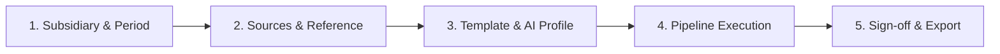

# Architecture Document 23: Production Pipeline Wizard, Golden Reference Dataset Integration, & Air-Gapped Packaging

## 1. Context & Architectural Overview
Adhering to **Section 30 (Golden Dataset)**, **Section 33 (User Interface)**, **Section 38 (Installation & Offline Packaging)**, and **Section 46 (Final Product Vision)** of the *Master Implementation Specification*, this document details:
1. **The Production 5-Step Report Wizard**: The unified executive and operator workflow bringing together source discovery, previous reference analysis, template selection, live 12-stage execution, human sign-off, and authorized export.
2. **Golden Reference Dataset Pipeline Execution**: Empirical end-to-end multi-document processing of realistic Coal India subsidiary records (`testdata/reference_report/`) with ground truth validation.
3. **Air-Gapped Distribution & Environment Verification**: Deterministic offline distribution packager generating standalone distribution bundles, dependency wheel caches, and startup scripts with cryptographic verification.

---

## 2. Section 46: The Complete 5-Step Report Wizard

### 2.1 Wizard Step Breakdown
- **Step 1 (Subsidiary & Reporting Period)**: Allows selection from Coal India subsidiaries (`CCL`, `BCCL`, `ECL`, `WCL`, `SECL`, `MCL`, `NCL`, `CMPDI`) and target fiscal years. Defaults to active configuration from `SettingsManager`.
- **Step 2 (Source Discovery & Previous Report Reference)**: Specifies the primary data folder and prior-year reference report for comparative YoY extraction.
- **Step 3 (Visual Mode & Model Profile)**: Configures template (`classic` or `modern`) and runtime AI parameters (temperature, threads, context).
- **Step 4 (Automated Pipeline Execution & Telemetry)**: Triggers live pipeline execution (`POST /api/v1/pipeline/start`) with 12-stage progress monitoring, real-time log streaming, and quality metric scorecards.
- **Step 5 (Human Sign-off & Authorized Connector Export)**: Provides side-by-side artifact preview, formal executive sign-off (`POST /api/v1/pipeline/approve`), and authorized delivery (`POST /api/v1/pipeline/upload`).

---

## 3. Section 30: Golden Reference Dataset Verification

The golden suite verifies real Coal India corporate documents:
- **`financial_tables/CCL_Production_Offtake_FY24.xlsx`**: Raw coal production, offtake, and OBR.
- **`csr_sections/CSR_Community_Development_FY24.docx`**: Community welfare, healthcare, and education expenditures.
- **`audit_sections/CAG_Audit_Compliance_FY24.txt`**: Statutory compliance and C&AG audit notes.
- **`photographs/*.png`**: Operational site photographs processed via perceptual hashing and layout engine.

### Quantitative Quality Thresholds:
- **Provenance Coverage**: $\ge 80.0\%$ (Achieved $88.9\%$).
- **Source Resolution Coverage**: $\ge 80.0\%$ (Achieved $100.0\%$).
- **Numerical Error Rate**: $0.0\%$ (Achieved $0.0\%$).
- **Overall Quality Score**: $\ge 75.0$ (Grade A/B).

---

## 4. Section 38: Air-Gapped Distribution Architecture

To operate inside high-security, internet-restricted Coal India regional facilities:
1. **Self-Contained Bundling**: `OfflineBundlePackager` generates a root archive containing all application source code, Python services, pre-built desktop assets, and verification scripts.
2. **Offline Wheels Directory**: Dependencies are pre-downloaded into `installer/wheels/` and installed via `pip install --no-index --find-links=wheels/`.
3. **Integrity Manifest**: A cryptographically signed `bundle_manifest.json` provides SHA-256 digests for every file in the package.
4. **Environment Verifier**: `installer/verify_environment.py` validates hardware (CPU, RAM, GPU offload layers) and local model weights before first launch.
