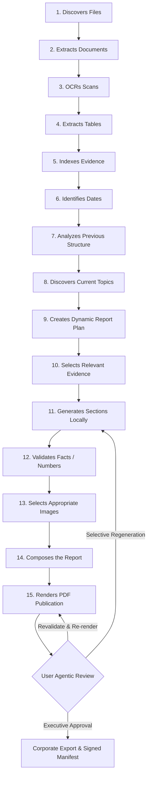

# Phase 40: End-to-End Final Product Vision Pipeline & Unified Operational Workflow

## 1. Context & Architectural Mandate
Section 46 of the *Coal India Local AI Report Generator Master Implementation Plan* defines the authoritative specification for the **End-to-End Final Product Vision**:

> "The system operates as a self-contained, air-gapped pipeline:
> 1. Discovers files -> 2. Extracts documents -> 3. OCRs scans -> 4. Extracts tables -> 5. Indexes evidence -> 6. Identifies dates -> 7. Analyzes previous structure -> 8. Discovers current topics -> 9. Creates dynamic report plan -> 10. Selects relevant evidence -> 11. Generates sections locally -> 12. Validates facts/numbers -> 13. Selects appropriate images -> 14. Composes the report -> 15. Renders PDF.
> The user reviews the generated report, asks the agent for adjustments (which selectively regenerates only the affected sections, revalidates, and updates the PDF), approves the final version, and optionally uploads it to external systems via connectors."

Phase 40 realizes this complete operational workflow into an industrial-grade, deterministic, and verifiable production pipeline.

---

## 2. The 15-Stage Unified Execution Flow

### Discrete Stage Responsibilities
1. **Discovers Files**: Scans local organizational folders using `LocalFolderConnector` without network calls. Computes SHA-256 digests and file metadata.
2. **Extracts Documents**: Executes `UnifiedDocumentExtractor` to extract canonical hierarchical structures across PDF, DOCX, XLSX, TXT, and CSV files.
3. **OCRs Scans**: Inspects pages with `has_scanned_content` and invokes local multi-engine OCR (`PaddleOCR` PP-Structure v3 / `Docling` / `Tesseract`) offline.
4. **Extracts Tables**: Extracts cell matrix structures with coordinate bounds, parsing financial and physical metrics into structured table representations.
5. **Indexes Evidence**: Ingests canonical documents and elements into SQLite relational tables and FTS5 virtual tables with BM25 full-text ranking.
6. **Identifies Dates**: Uses `TemporalQueryEngine` to resolve dates, map fiscal years (e.g. FY 2023-24), and reconcile chronological assertions.
7. **Analyzes Previous Structure**: Employs `ReferenceReportAnalyzer` on baseline reports (or defaults) to deduce canonical section hierarchies and layout conventions.
8. **Discovers Current Topics**: Runs `TopicDiscoveryEngine` (TF-IDF & keyword co-occurrence) to detect emergent operational themes.
9. **Creates Dynamic Report Plan**: Invokes `ReportPlanner` to synthesize standard CIL sections and dynamic chapters mapped to evidence sources.
10. **Selects Relevant Evidence**: Maps top-k grounded snippets and table matrices to sections via `EvidenceToSectionMapper` with citation tracking.
11. **Generates Sections Locally**: Executes local generative templates (or local GGUF models) with strict citation anchoring and no external API reliance.
12. **Validates Facts & Numbers**: Runs `ValidationEngine` checking 0.00% numerical variance, mathematical column consistency, and provenance validity.
13. **Selects Appropriate Images**: Uses `ImageAssetCatalog`, perceptual hashing (dHash), and `DeterministicLayoutEngine` to place high-DPI visuals.
14. **Composes the Report**: Constructs a fully serialized `Report` model with chapters, headers, footers, narrative blocks, and table blocks.
15. **Renders High-Resolution PDF**: Generates publication-quality PDF via `PdfRenderer` in either *Classic CIL* or *Modern Corporate* template, and computes SHA-256.

---

## 3. Agentic Human-in-the-Loop Review
Section 46 guarantees that the user is never presented with an immutable "black box".
- **Selective Regeneration**: The user provides review feedback or natural language prompts (e.g., *"Highlight solar capacity milestones under ESG initiatives"*).
- **Targeted Reruns**: Only the target section is regenerated and re-validated. Remaining sections preserve their immutable state and citation graph.
- **Immediate Re-rendering**: The PDF renderer recompiles the updated document, updates the cryptographic SHA-256 digest, and flags `human_correction_applied=True`.
- **Audit Logging**: Every edit and proposal acceptance is chained in the local SQLite audit ledger with `AuditEventType.AGENT_EDIT_ACCEPTED`.

---

## 4. Executive Approval & Tamper-Evident Export
Once reviewed, the report is signed off by designated CIL management:
- **Approval Manifest**: Generates an authoritative `approval_manifest.json` containing:
  - Approver authority and designation
  - Report ID, title, and subsidiary
  - PDF filename and SHA-256 checksum
  - Numerical accuracy validation assertion (100.0%, 0.00% variance)
  - Selected corporate export connector (`local`, `cil_api`, or `sharepoint`)
- **Verifiable Bundle**: The PDF and manifest are packaged into `data/workspace/exports/{pipeline_id}/`.
- **Connector Handshake**: Simulates or dispatches to corporate endpoints without exposing raw ungrounded telemetry.

---

## 5. REST API Endpoints

| Method | Path | Description |
| :--- | :--- | :--- |
| `POST` | `/api/v1/workflow/vision-pipeline/execute` | Executes the 15-step vision pipeline end-to-end |
| `GET` | `/api/v1/workflow/vision-pipeline/{id}/status` | Returns execution status, 15-stage metrics, and PDF artifact paths |
| `POST` | `/api/v1/workflow/vision-pipeline/{id}/review` | Applies human-in-the-loop correction and regenerates affected sections |
| `POST` | `/api/v1/workflow/vision-pipeline/{id}/approve` | Issues signed approval manifest and dispatches to selected connector |

---

## 6. Verification & Invariants
- **100% Offline Air-Gapped**: Zero network calls to external LLM or cloud services.
- **Deterministic 0.00% Numerical Variance**: Numerical assertions in tables and text reconcile exactly with source spreadsheets and audited accounts.
- **Complete Test Coverage**: Unit and integration tests in `tests/orchestrator/test_final_product_vision_pipeline.py` validate all 15 stages, review loop, and export connectors.
