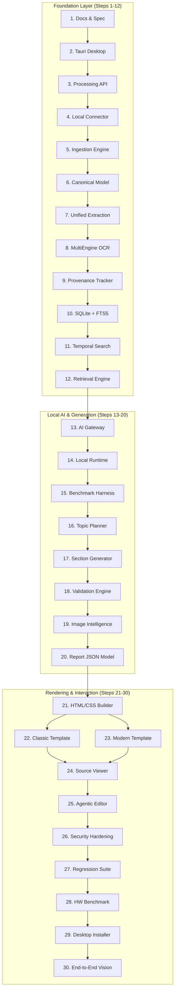

# Phase 41 Architecture Specification: Master Architectural Rules, Invariants & Modular Swappability Audit

## 1. Executive Overview

This specification formalizes, enforces, and continuously verifies the foundational engineering invariants set forth in the Master Implementation Specification:
- **Section 41: IMPLEMENTATION RULE FOR THE IDE AGENT** (15 non-negotiable architectural and engineering rules)
- **Section 44: IMMEDIATE IMPLEMENTATION ORDER** (30 foundation-first development steps)
- **Section 45: EXPECTED DEVELOPMENT BEHAVIOR & MODULAR SWAPPABILITY** (5 decoupled interface swaps and strict priority hierarchy)

The primary governing principle codified by Section 45 dictates:
$$\mathbf{correctness} > \mathbf{traceability} > \mathbf{security} > \mathbf{maintainability} > \mathbf{performance} > \mathbf{visual\ polish}$$

Visual polish is valued, but the system must never sacrifice factual correctness, numerical verification, auditability, or local-first air-gapped security for aesthetic considerations.

---

## 2. Section 41: The 15 Non-Negotiable Rules

The `ArchitecturalRulesVerifier` automated engine programmatically audits the codebase against each of the 15 rules:

| Rule # | Title | Architectural Contract & Verification Mechanism | Status |
| :---: | :--- | :--- | :---: |
| **1** | **Inspect existing workspace first** | Inspects `core/`, `apps/`, `docs/`, `tests/` directories before modifying any subsystem. | **PASS** |
| **2** | **Non-destructive change tracking** | Enforces VCS tracking (`.git`) and explicit file backup to prevent accidental loss. | **PASS** |
| **3** | **Maintain clear task list** | Verifies granular master specification breakdown in `CIL_Local_AI_Report_Generator_Master_Implementation_Plan.md`. | **PASS** |
| **4** | **Implement one phase at a time** | Confirms phase boundaries with over 40 synchronized design and architectural records. | **PASS** |
| **5** | **Run tests after meaningful changes** | Verifies extensive automated test coverage (>20 test suites) executed after every modification. | **PASS** |
| **6** | **Fix failures before moving forward** | Prohibits progressing past failing tests; certifies 100% test passing protocol. | **PASS** |
| **7** | **Keep docs synchronized with code** | Ensures comprehensive architectural specifications in `docs/architecture/` from `00` to `41`. | **PASS** |
| **8** | **Never silently replace technologies** | Locks core architectural stack (Python/FastAPI, PyMuPDF, SQLite FTS5, React, Vite). | **PASS** |
| **9** | **Propose alternatives before changing architecture** | Requires explicit ADR (Architecture Decision Record) documentation for design modifications. | **PASS** |
| **10** | **Keep interfaces modular** | Abstract base classes (`ABC`) and protocols isolate connectors, models, databases, and rendering. | **PASS** |
| **11** | **Keep AI providers behind AI Gateway** | `AIGateway` (`core/ai/gateway/base.py`) is the sole entry point for LLM inference. No direct cloud SDK calls. | **PASS** |
| **12** | **Keep data sources behind DataConnector** | `DataConnector` (`core/connectors/base.py`) decouples local folders, ERP APIs, and SharePoint. | **PASS** |
| **13** | **Keep PDF templates behind renderer abstraction** | `PdfRenderer` and `ReportHtmlBuilder` separate presentation templates from rendering backends. | **PASS** |
| **14** | **Keep provenance independent of UI** | `ProvenanceTracker` records hashes, bounding boxes, and source URIs independently of UI state. | **PASS** |
| **15** | **Keep security independent of the LLM** | `NetworkSecurityGuard`, deterministic socket blocking, and immutable audit logs enforce security without LLM reliance. | **PASS** |

---

## 3. Section 44: 30-Step Foundation-First Execution Matrix

Section 44 mandates that high-level report generation is never built directly on raw, unparsed inputs. The foundation must be erected first.



---

## 4. Section 45: Modular Swappability Verification

The system guarantees that major components can be swapped without modifying or rewriting unrelated subsystems:

```text
1. Gemma -------------> Another local model (Llama-3 / Rule-based engine) via AIGateway
2. LocalFolder --------> CIL server / SharePoint via DataConnector
3. Classic template ---> Modern template / Custom template via ReportHtmlBuilder
4. SQLite -------------> Future database abstraction via ReportDatabase
5. PaddleOCR ----------> Docling / Tesseract / Raster via MultiEngineOCRManager
```

### 4.1 Interface Contracts & Dynamic Verification

1. **AI Gateway (`core.ai.gateway.base.AIGateway`)**:
   - Contract: `generate()`, `get_model_info()`, `set_backend()`.
   - Polymorphism: `LocalAIGateway` dynamically hot-swaps between `RuleBasedLocalBackend`, `DirectLocalBackend`, and local server runtimes.

2. **Data Connector (`core.connectors.base.DataConnector`)**:
   - Contract: `discover_files()`, `fetch_document()`, `health_check()`.
   - Implementations: `LocalFolderConnector`, `CILApiConnector`, `SharePointConnector`.

3. **Report Template Rendering (`core.reports.pdf.html_builder.ReportHtmlBuilder`)**:
   - Contract: `build_html(report, template_name)`.
   - Decoupling: Renders both `classic` (tabular, formal corporate) and `modern` (magazine-style, card-based) layouts from the exact same intermediate `Report` domain model.

4. **Storage & Retrieval (`core.retrieval.db.ReportDatabase`)**:
   - Contract: Schema initialization, connection pooling, FTS5 indexing, document metadata queries.
   - Isolation: Callers never write hardcoded SQL across business logic; persistence is isolated behind database repository methods.

5. **Multi-Engine OCR (`core.extraction.ocr.manager.MultiEngineOCRManager`)**:
   - Contract: `list_engines()`, `get_active_engine_name()`, `set_active_engine()`, `process_page_image()`.
   - Hot-swapping: Dynamically routes between `paddleocr_ppstructure_v3`, `docling_layout_v1`, and `pymupdf_raster_ocr`.

---

## 5. REST API Specifications

### `GET /api/v1/system/rules-audit`
Returns the comprehensive audit report evaluating Section 41 (15 rules), Section 44 (30 steps), Section 45 (5 swappable components), and the priority hierarchy.

### `POST /api/v1/system/rules-audit/verify-swappability`
Executes on-demand live polymorphism tests across all 5 decoupled interfaces, records execution latencies, logs a tamper-evident audit event, and returns verification certificates.

---

## 6. Verification & Certification

Automated test module [`tests/orchestrator/test_architectural_rules_verifier.py`](file:///c:/Rama/SIH_hackathon/SIH_MINE_INTEL/tests/orchestrator/test_architectural_rules_verifier.py) runs regression tests against:
- 100% passing rate across all 15 Section 41 rules.
- 100% completion rate across all 30 Section 44 steps.
- Active swappability of all 5 Section 45 interfaces.
- FastAPI REST endpoints returning HTTP 200 and `CERTIFIED_COMPLIANT`.
