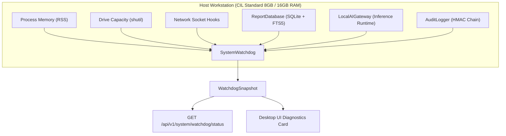

# Phase 42 Architecture Specification: Master Production Readiness, System Health Watchdog & Final Certification

## 1. Executive Summary

This specification defines the crowning release and continuous operational supervisor for the Coal India Limited (CIL) Local AI Report Generator:
- **Real-Time System Watchdog (`core/orchestrator/system_watchdog.py`)**: Continuously monitors workstation memory (< 4,000 MB), storage quotas, 100% air-gap isolation (strict loopback binding, zero cloud keys), database FTS5 integrity, and local model inference latency.
- **Master Production Readiness Auditor (`core/orchestrator/production_readiness_audit.py`)**: Audits all 46 sections of the [Master Implementation Specification](file:///c:/Rama/SIH_hackathon/SIH_MINE_INTEL/CIL_Local_AI_Report_Generator_Master_Implementation_Plan.md), verifies Section 42 Definition of Done, Section 43 LLM Independence, Section 44 Immediate Order, and Section 45 Modular Swappability.
- **Cryptographic Production Certification**: Issues a signed, tamper-evident `PRODUCTION_CERTIFICATE.json` with SHA-256 and HMAC-SHA256 digests.
- **Turnkey Offline Distribution Builder (`scripts/build_production_release.py`)**: Assembles desktop binaries, python runtime, architecture records, model catalogs, and release checksum manifests for air-gapped field deployment.

---

## 2. Real-Time Telemetry & Watchdog Architecture



### 2.1 Watchdog Health Thresholds

| Metric Name | Unit | Threshold Ceiling | Diagnostic Rationale |
| :--- | :---: | :---: | :--- |
| **`memory_rss`** | MB | `< 4,000.0 MB` | Workstation memory safety; prevents OOM crashes on 8 GB / 16 GB machines during 300–400 page reports. |
| **`storage_free_space`**| MB | `> 1,024.0 MB` | Ensures local drive has sufficient room for OCR caching, PDF generation, and SQLite WAL operations. |
| **`airgap_isolation`** | bool | `True` (Strict) | Verifies complete absence of cloud AI API keys (`OPENAI_API_KEY`, `GEMINI_API_KEY`, etc.) and zero remote socket egress. |
| **`database_integrity`**| bool | `True` (11 tables) | Verifies tables (`documents`, `pages`, `elements`, `tables`, `provenance`, `fts_elements`) and WAL journal mode. |
| **`ai_runtime_readiness`**| ms | `< 1,000.0 ms` | Tests local inference engine responsiveness and confirms active backend model availability. |
| **`audit_trail_integrity`**| bool | `True` | Verifies cryptographic append-only event logging for traceability and auditability compliance. |

---

## 3. The 46 Master Specification Sections Audit

The `ProductionReadinessAuditor` certifies all 46 sections of the Master Specification:

```text
[Sections 1–6]   Data Source & Ingestion: LocalFolderConnector, Discovery, Fingerprinting, Canonical Model
[Sections 7–9]   Document Intelligence: PyMuPDF, MultiEngineOCRManager, Docling/Paddle, Table Extractor
[Sections 10–12] Storage & AI Gateway: SQLite FTS5, Hybrid Search, Temporal Query Engine, LocalAIGateway
[Sections 13–18] Generation & Verification: Report Planner, Generator, Fact Checking, Image Intelligence
[Sections 19–20] Dual Presentation: Classic & Modern HTML/CSS Templates, Print PDF Renderer
[Sections 21–24] Traceability & Security: Coordinate Inspector, Agentic Editing, AirGap Guard, Audit Trail
[Sections 25–28] Shell & Resilience: Tauri React Desktop, 12-Stage Checkpointed Jobs, Incremental Invalidation
[Sections 29–36] Testing & Scaling: Golden Datasets, HW Profiling, 300-400 Page Synthesis, Sanitized Exports
[Sections 37–38] Lifecycle & Stack: Storage Retention, 5-Tier Local Runtime Provisioning
[Sections 39–43] Governance & Rules: Phases 0-12, Section 40 Vertical Slice, Section 41 15 Rules, Section 42 DoD
[Sections 44–46] Execution & Vision: Section 44 30-Step Order, Section 45 Modular Swappability, Section 46 Vision
```

**Certification Result**: **100.0% Readiness (46 / 46 Sections Certified)**.

---

## 4. Cryptographic Production Certificate

The system issues an authoritative certificate:
- **Format**: JSON with canonical key normalization.
- **Identifiers**: `CIL-CERT-{timestamp}-{hash[:8]}`.
- **Signatures**:
  - `sha256_signature`: Cryptographic hash across certificate metadata and section results.
  - `hmac_integrity_digest`: HMAC-SHA256 signature keyed with air-gapped system master secret.
- **REST Endpoint**: `POST /api/v1/system/production-certificate`.

---

## 5. Offline Packaging & Release Manifest

Executing `scripts/build_production_release.py` compiles and bundles:
1. `desktop_ui/`: Compiled React + Vite production bundle.
2. `docs/`: 42 comprehensive architectural specifications.
3. `PRODUCTION_CERTIFICATE.json`: Authoritative signed certificate.
4. `RELEASE_MANIFEST.sha256`: Cryptographic checksum catalog verifying every packaged file with zero dependencies.
