# Architecture Document 43: Strict LLM-Independence Invariant Verification & Deterministic Core Isolation

## 1. Executive Summary & Section 43 Requirement
Section 43 of the **Coal India Limited Local AI Report Generator Master Implementation Specification** establishes the foundational architectural principle governing the entire platform:

> **"The system's source data, structured evidence, deterministic calculations, provenance, validation and report model must remain independent of the local LLM.**  
> **The LLM is a powerful reasoning/generation component inside this architecture—not the architecture itself."**

If the local LLM produces hallucinated numbers, the deterministic calculations take absolute precedence. If the LLM generates narrative claims without supporting evidence, the validation engine marks them as unverified or insufficient evidence.

Furthermore, the architecture guarantees a **Zero-LLM Operation Mode**: even if all local neural model weights are unloaded or the AI Gateway is completely offline, the system can ingest documents, extract tables, execute exact arithmetic aggregations, verify invariants, and render publication-grade PDF reports.

---

## 2. The 6 Invariant Layers of Independence

```mermaid
graph TD
    A[Layer 1: Source Data & Ingestion] --> B[Layer 2: Canonical Evidence Model]
    B --> C[Layer 3: Deterministic Calculations]
    B --> D[Layer 4: Immutable Provenance Tracking]
    C --> E[Layer 5: Independent Validation Engine]
    D --> E
    E --> F[Layer 6: Report Model & Dual Template PDF Rendering]
    
    subgraph "Local LLM / SLM (Optional Reasoning & Drafting Plugin)"
        G[AIGateway / Llama-3 / Qwen-2.5]
    end
    
    G -.->|Drafts Narratives / Summarizes Only| F
    style G fill:#2d1b4e,stroke:#9333ea,stroke-width:2px,stroke-dasharray: 5 5
    style E fill:#064e3b,stroke:#10b981,stroke-width:2px
    style C fill:#064e3b,stroke:#10b981,stroke-width:2px
```

### Layer 1: Source Data & Ingestion
- **Implementation**: `core/connectors/`, `core/ingestion/discovery.py`, `core/ingestion/formats.py`.
- **Independence Invariant**: File discovery, MIME-type recognition, and cryptographic fingerprinting (SHA-256) operate entirely via standard system I/O and cryptographic libraries.
- **Guarantee**: Source records are immutable and reproducible across all operating platforms.

### Layer 2: Canonical Evidence Model
- **Implementation**: `core/domain/documents.py`, `core/domain/evidence.py`, `core/extraction/unified.py`.
- **Independence Invariant**: Documents are parsed into a normalized hierarchical representation (`Document` -> `Page` -> `Block` -> `Table` -> `Cell`) with normalized spatial bounding boxes `[left, top, width, height]`.
- **Guarantee**: Evidence structures exist prior to and independent of any LLM prompt or context window.

### Layer 3: Deterministic Calculations & Arithmetic Engine
- **Implementation**: `core/validation/numerical.py`.
- **Independence Invariant**: Arithmetic summations, row-column totals, year-over-year percentage variances, and multimodal dispatch share percentages (e.g. Rail 62.1% + Road 22.7% + MGR 15.2% = 100.0%) are calculated using deterministic Python IEEE floating point and decimal arithmetic.
- **Guarantee**: Under no circumstances does an LLM prompt calculate report numbers. Mathematical truth is invariant.

### Layer 4: Immutable Provenance Tracking
- **Implementation**: `core/provenance/tracker.py`.
- **Independence Invariant**: Every statement and numerical entity binds to a unique `provenance_id`, `document_id`, `page_number`, spatial bounding box, and cryptographic content snippet hash.
- **Guarantee**: Citations are structurally enforced by the data model, preventing AI hallucination from injecting fabricated references.

### Layer 5: Independent Validation Engine
- **Implementation**: `core/validation/engine.py`, `core/validation/numerical.py`, `core/validation/temporal.py`, `core/validation/structural.py`.
- **Independence Invariant**: Multi-dimensional verification runs purely on algorithmic rules, heuristics, and mathematical checks.
- **Guarantee**: The platform does not rely on "LLM self-evaluation" or model introspection to determine report validity.

### Layer 6: Report Model & Dual Template PDF Rendering
- **Implementation**: `core/domain/reports.py`, `core/reports/pdf/html_builder.py`, `core/reports/pdf/renderer.py`.
- **Independence Invariant**: The intermediate report structure is transformed into publication-grade HTML and rasterized to PDF (via headless Chromium or PyMuPDF) using deterministic CSS Paged Media rules.
- **Guarantee**: Visual presentation, page budgets, headers, footers, and tables render identically whether narratives are generated with AI or via deterministic templates.

---

## 3. Zero-LLM Report Generation Pipeline

The `LLMIndependenceAuditor` provides `execute_zero_llm_generation()`:
1. **Direct Data Binding**: Synthesizes verified operational figures (Opencast 128.45 MT + Underground 14.15 MT = 142.60 MT, +7.0% YoY).
2. **Deterministic Sections**: Builds executive narrative blocks, arithmetic matrices, and ESG performance summaries with embedded provenance references.
3. **Automated Validation**: Runs `ValidationEngine.validate_report()` and confirms zero numerical or structural errors.
4. **Publication PDF**: Renders print-ready PDF and HTML documents with running headers, footers, and page numbers.
5. **Telemetry Enforcement**: Verifies that `llm_invocations_count == 0` is strictly true.

---

## 4. API Endpoints & Operational Verification

| Method | Endpoint | Purpose |
| :--- | :--- | :--- |
| `GET` | `/api/v1/system/llm-independence/audit` | Audits all 6 invariant layers and returns compliance score (100%). |
| `POST` | `/api/v1/system/llm-independence/zero-llm-generation` | Executes live Zero-LLM pipeline and produces certified PDF/HTML. |

---

## 5. Summary
Phase 43 guarantees that Coal India Limited's mission-critical enterprise intelligence platform remains mathematically sound, audit-proof, and fully operational even under catastrophic local AI hardware failures or air-gapped constraints where neural model execution is disabled.
