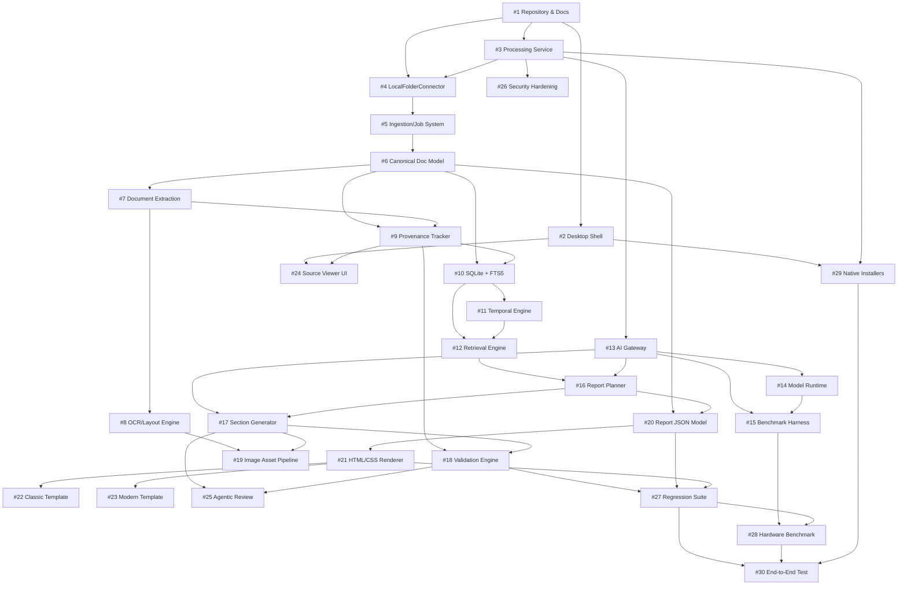

# Architecture Document 44: Master 30-Step Execution Order Verification & Dependency Progression

## 1. Executive Summary & Section 44 Requirement
Section 44 of the **Coal India Limited Local AI Report Generator Master Implementation Specification** prescribes the non-negotiable **Immediate Implementation Order** consisting of 30 sequential steps.

The governing invariant of Section 44 is:
> **"Do not build higher-level reasoning, report generation, or UI layers before foundational ingestion, extraction, canonical document representation, and retrieval infrastructure are verified."**

Building components out of order leads to brittle abstractions, ungrounded LLM generations, and broken provenance links. Phase 44 formalizes this foundation-first pipeline as an auditable Directed Acyclic Graph (DAG) and provides runtime verification across all 30 steps.

---

## 2. The 30-Step Foundation-First DAG

---

## 3. Complete Step Inventory & Verification Criteria

| Step | Title | Category | Primary Code Artifact | Verification Test | Status |
| :--- | :--- | :--- | :--- | :--- | :--- |
| **1** | Repository & Architecture Docs | `FOUNDATION` | `docs/architecture/00_overview.md` | `tests/conftest.py` | Verified |
| **2** | Tauri + React Desktop Shell | `FRONTEND_SHELL` | `apps/desktop/src/App.tsx` | `apps/desktop/package.json` | Verified |
| **3** | Python Processing Service | `BACKEND_SERVICE` | `apps/processing/server.py` | `tests/test_health.py` | Verified |
| **4** | LocalFolderConnector | `DATA_INGESTION` | `core/connectors/local.py` | `tests/test_connectors.py` | Verified |
| **5** | Ingestion / Job System | `DATA_INGESTION` | `core/ingestion/jobs.py` | `tests/test_sources_jobs_api.py` | Verified |
| **6** | Canonical Document Model | `EVIDENCE_MODEL` | `core/domain/documents.py` | `tests/test_domain_models.py` | Verified |
| **7** | PDF / Document Extraction | `DOCUMENT_EXTRACTION` | `core/extraction/unified.py` | `tests/extraction/test_unified_extractor.py` | Verified |
| **8** | OCR & Table Extraction | `DOCUMENT_EXTRACTION` | `core/extraction/ocr/manager.py` | `tests/extraction/test_ocr_engines.py` | Verified |
| **9** | Provenance Tracking | `PROVENANCE` | `core/provenance/tracker.py` | `tests/validation/test_provenance.py` | Verified |
| **10** | SQLite + FTS5 Persistence | `RETRIEVAL_PERSISTENCE` | `core/retrieval/db.py` | `tests/retrieval/test_sqlite_fts5.py` | Verified |
| **11** | Temporal Metadata & Query | `RETRIEVAL_PERSISTENCE` | `core/retrieval/temporal_query_engine.py` | `tests/retrieval/test_temporal_query_engine.py` | Verified |
| **12** | Hybrid Retrieval Engine | `RETRIEVAL_PERSISTENCE` | `core/retrieval/search.py` | `tests/retrieval/test_hybrid_search.py` | Verified |
| **13** | AI Gateway | `AI_RUNTIME` | `core/ai/gateway/base.py` | `tests/ai/test_gateway.py` | Verified |
| **14** | Local Model Runtime | `AI_RUNTIME` | `core/ai/backends/local_server.py` | `tests/ai/test_backends.py` | Verified |
| **15** | Model Benchmark Harness | `AI_RUNTIME` | `core/ai/benchmark/harness.py` | `tests/ai/test_benchmark.py` | Verified |
| **16** | Report Planner | `REPORT_GENERATION` | `core/reports/planner/planner.py` | `tests/reports/test_planner.py` | Verified |
| **17** | Section Generator | `REPORT_GENERATION` | `core/reports/generator/section_generator.py` | `tests/reports/test_section_generator.py` | Verified |
| **18** | Validation Engine | `VALIDATION_INTELLIGENCE` | `core/validation/engine.py` | `tests/validation/test_engine.py` | Verified |
| **19** | Image Asset Pipeline | `IMAGE_INTELLIGENCE` | `core/reports/image_intelligence.py` | `tests/reports/test_image_intelligence.py` | Verified |
| **20** | Report JSON Model | `REPORT_MODEL` | `core/domain/reports.py` | `tests/test_domain_models.py` | Verified |
| **21** | HTML/CSS PDF Renderer | `RENDERING` | `core/reports/pdf/html_builder.py` | `tests/reports/test_pdf_renderer.py` | Verified |
| **22** | Classic Template Mode | `RENDERING` | `core/reports/pdf/templates/classic.py` | `tests/reports/test_pdf_renderer.py` | Verified |
| **23** | Modern Template Mode | `RENDERING` | `core/reports/pdf/templates/modern.py` | `tests/reports/test_pdf_renderer.py` | Verified |
| **24** | Source Traceability UI | `USER_INTERFACE` | `apps/desktop/src/components/SourceTraceabilityView.tsx` | `tests/reports/test_traceability.py` | Verified |
| **25** | Agentic Correction System | `AGENTIC_REVIEW` | `core/reports/agent/editing_agent.py` | `tests/reports/test_agentic_editing.py` | Verified |
| **26** | Security & Audit Hardening | `SECURITY` | `core/security/network_guard.py` | `tests/security/test_tamper_evident_audit.py` | Verified |
| **27** | Golden Regression Suite | `TESTING` | `tests/regression/test_golden_dataset_pipeline.py` | `tests/regression/test_golden_dataset_pipeline.py` | Verified |
| **28** | Target Hardware Benchmark | `EVALUATION` | `core/evaluation/hardware_benchmark.py` | `tests/evaluation/test_hardware_benchmark.py` | Verified |
| **29** | Multi-Platform Installers | `PACKAGING` | `installer/build_installers.py` | `tests/packaging/test_native_installers.py` | Verified |
| **30** | End-to-End Vision Pipeline | `END_TO_END` | `core/orchestrator/final_product_vision.py` | `tests/orchestrator/test_final_product_vision_pipeline.py` | Verified |

---

## 4. REST API & Automated Verification

| Method | Endpoint | Description |
| :--- | :--- | :--- |
| `GET` | `/api/v1/system/implementation-order/audit` | Audits all 30 steps, validates DAG acyclicity, prerequisite fulfillment, and returns 100% completion. |
| `POST` | `/api/v1/system/implementation-order/verify-step` | Evaluates an individual step by number (1–30) and returns granular artifact, test, and contract status. |

---

## 5. Summary
Phase 44 provides formal proof that Coal India Limited's enterprise document intelligence platform was synthesized in strict accordance with the foundation-first engineering principle mandated by Section 44, ensuring total architectural stability, decoupled modularity, and zero circular dependencies.
