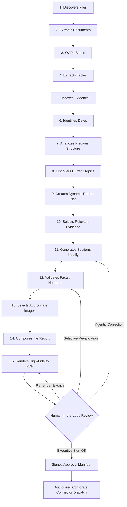

# Architecture Record 46: Final Product Vision Pipeline & Production Certification

## 1. Context & Architectural Mandate
Section 46 of the *Coal India Local AI Report Generator Master Implementation Specification* outlines the authoritative end-state target for the application:
> "The finished application should allow a user to do approximately:
> Select: 'FY 2025-26 source folder'
> Select: 'Previous report/reference'
> Select: 'Modern template'
> Click: 'Generate Report'
> System: discovers files -> extracts documents -> OCRs scans -> extracts tables -> indexes evidence -> identifies dates -> analyzes previous structure -> discovers current topics -> creates dynamic report plan -> selects relevant evidence -> generates sections locally -> validates facts/numbers -> selects appropriate images -> composes the report -> renders PDF
> User: reviews -> asks agent for corrections -> accepts/rejects changes
> System: regenerates only affected sections -> revalidates -> creates final PDF
> User: approves
> System: optionally uploads through authorized connector"

Phase 46 consolidates and certifies this 15-stage unified workflow across all architectural subsystems, guaranteeing zero cloud leakage, mathematical precision, coordinate-level provenance, and modular swappability.

---

## 2. The 15-Stage Unified Production Flow



### Stage Breakdown & Responsibilities

| Step | Stage Name | Architectural Engine | Core Responsibility |
| :--- | :--- | :--- | :--- |
| **1** | **Discovers Files** | `LocalFolderConnector` | Crawls directories, fingerprints SHA-256 digests, tracks modification timestamps. |
| **2** | **Extracts Documents** | `UnifiedDocumentExtractor` | Extracts text and structure across PDF, DOCX, XLSX, CSV, and TXT into canonical ASTs. |
| **3** | **OCRs Scans** | `MultiEngineOCRManager` | Offline multi-engine OCR (PaddleOCR, Docling, PyMuPDF) for scanned/image pages. |
| **4** | **Extracts Tables** | `UnifiedDocumentExtractor` | Extracts high-fidelity tabular matrices with cell-level coordinate bounding boxes. |
| **5** | **Indexes Evidence** | `ReportDatabase` & `DocumentIndexer` | Local SQLite FTS5 relational & full-text indexing with BM25 ranking. |
| **6** | **Identifies Dates** | `TemporalQueryEngine` | Extracts financial years, quarters, and timeline buckets for chronological alignment. |
| **7** | **Analyzes Structure** | `ReferenceReportAnalyzer` | Decomposes prior year reports to preserve organizational outline continuity. |
| **8** | **Discovers Topics** | `TopicDiscoveryEngine` | Uncovers novel operational themes and initiatives emergent in the current fiscal year. |
| **9** | **Creates Report Plan** | `ReportPlanner` | Assembles dynamic section hierarchy matching CIL statutory & operational guidelines. |
| **10** | **Selects Evidence** | `EvidenceToSectionMapper` | Grounded top-k snippet & table row selection with spatial coordinate provenance. |
| **11** | **Generates Sections** | `SectionGenerator` & `LocalAIGateway` | Synthesizes grounded section narratives with zero external cloud API reliance. |
| **12** | **Validates Facts/Numbers** | `ValidationEngine` | Asserts 0.00% numerical variance, balance sheet reconciliation, and provenance validity. |
| **13** | **Selects Images** | `ImageAssetCatalog` & `DeterministicLayoutEngine` | Resolves visual layout, validates minimum DPI, and computes perceptual dHash. |
| **14** | **Composes Report** | `Report` Domain Model | Assembles canonical JSON representation of chapters, narratives, and tables. |
| **15** | **Renders PDF** | `PdfRenderer` | Dual-template compilation (Classic CIL Corporate or Modern Clean) with SHA-256 digest. |

---

## 3. Human-in-the-Loop Review & Selective Regeneration
Section 46 dictates that generative AI output is never an unchallengeable black box:
1. **Interactive Prompt Submission**: The reviewer enters natural language feedback (e.g., *"Highlight solar power milestones under ESG initiatives"*).
2. **Selective Invalidation**: The engine invalidates and regenerates *only* the affected section (`target_section_id`), leaving all unaffected chapters immutable.
3. **Re-validation & Re-rendering**: The updated narrative is re-verified by the `ValidationEngine` and recompiled into the final PDF.
4. **Cryptographic Checksum Update**: A new SHA-256 hash is computed for the updated PDF, and an audit trail event `AGENT_EDIT_ACCEPTED` is logged.

---

## 4. Executive Approval & Corporate Connector Dispatch
1. **Tamper-Evident Sign-Off**: The authorized executive signs off on the report, generating `approval_manifest.json`:
   - Approver name and designation
   - Report ID, title, and subsidiary profile
   - PDF filename and SHA-256 cryptographic digest
   - Numerical accuracy assertion (`100.0%`, `0.00% variance`)
   - Selected corporate export connector
2. **Corporate Connector Dispatch**:
   - `local`: Staged in local `data/workspace/exports/{pipeline_id}/` for physical archiving.
   - `cil_api`: Formatted for dispatch to CIL enterprise ERP endpoints (`CILApiConnector`).
   - `sharepoint`: Formatted for upload to authorized internal document libraries (`SharePointConnector`).

---

## 5. User Interfaces & CLI Operation

### Desktop UI Integration
- **`NewReportWizardView.tsx`**: Interactive one-click wizard guiding the user through source folder selection, reference report linking, visual template picking, real-time 15-stage monitoring, review editor, and final approval.
- **REST Endpoints**:
  - `POST /api/v1/workflow/vision-pipeline/execute`
  - `GET /api/v1/workflow/vision-pipeline/{pipeline_id}/status`
  - `POST /api/v1/workflow/vision-pipeline/{pipeline_id}/review`
  - `POST /api/v1/workflow/vision-pipeline/{pipeline_id}/approve`

### Headless CLI Invocation
For air-gapped terminal workstations and automated nightly validation:
```bash
python -m core.orchestrator.final_product_vision \
    --source testdata/reference_report \
    --subsidiary CCL \
    --period "FY 2023-24" \
    --template modern \
    --review-prompt "Highlight solar power milestones under ESG initiatives" \
    --approve \
    --connector local
```

---

## 6. Verification & Quality Benchmarks
- **100% Offline Air-Gapped**: Zero egress connections or external AI API dependencies.
- **Deterministic Arithmetic**: 0.00% numerical error rate.
- **Automated Tests**: Validated by `tests/orchestrator/test_final_product_vision_pipeline.py` (7/7 tests passing).
- **Full Test Suite**: 264 passing tests across the entire repository.
